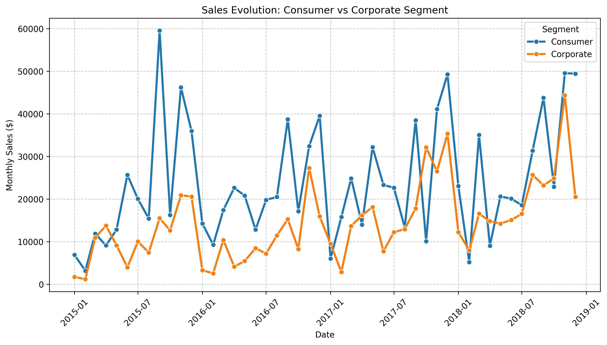
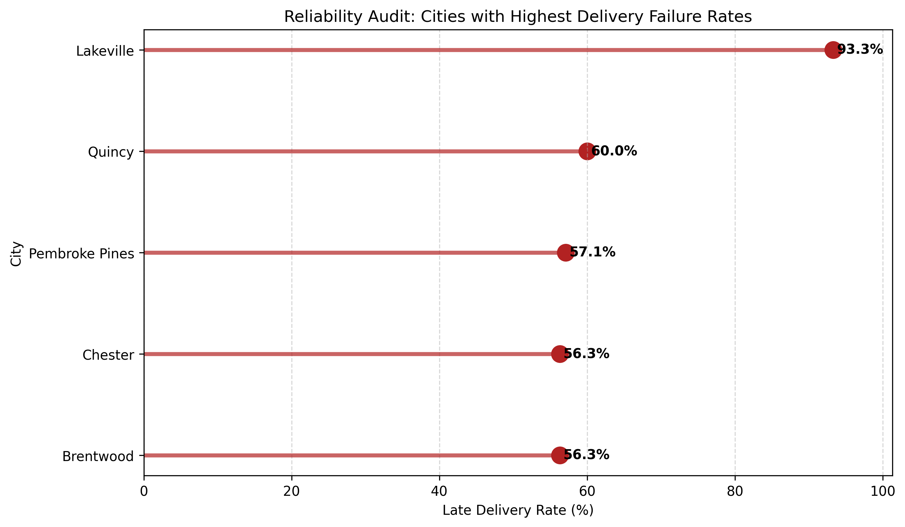
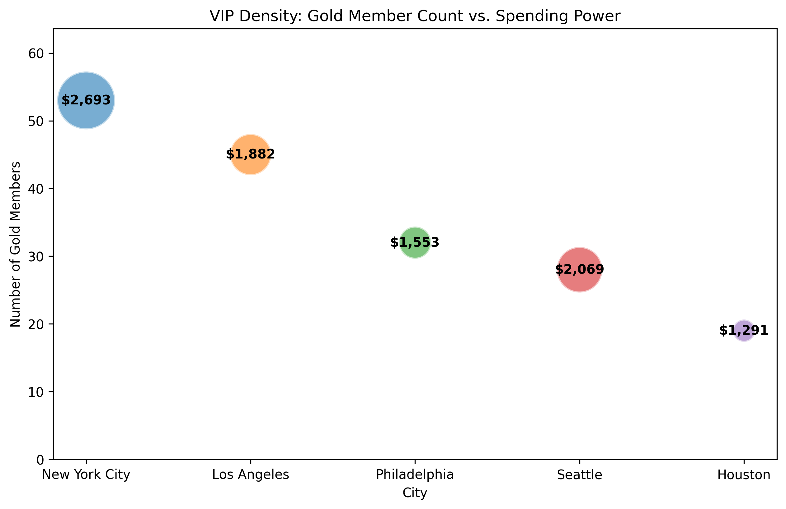

# Retail Sales & Logistics Analytics with PySpark

## Project Overview
This project presents an end-to-end **retail analytics workflow** built with **PySpark** to analyze transactional sales data from the Superstore dataset.

Starting from a single raw CSV file, the analysis constructs multiple analytical DataFrames to evaluate:

- Sales performance over time  
- Customer value and loyalty segmentation  
- Logistics efficiency and delivery reliability  
- Product and category revenue contribution  

**Objective:** Transform raw transactional data into **actionable business insights** through scalable data processing and visual analytics.

---

## Data Processing Architecture

The workflow is structured into **six analytical DataFrames** derived from a unified master dataset:

| DataFrame | Business Role |
|-----------|---------------|
| **DF1 – Master View** | Data loading, cleaning, and date normalization |
| **DF2 – Monthly Growth Engine** | Month-over-month revenue evolution by customer segment |
| **DF3 – Daily Sales View** | Weekday vs weekend behavioral sales patterns |
| **DF4 – Shipping Performance** | Delivery delay computation and late-delivery detection |
| **DF5 – Customer Value & Loyalty** | Customer segmentation using lifetime value, frequency, and diversity |
| **DF6 – Category Revenue & Pricing** | Revenue distribution and pricing metrics per product category |

This layered architecture enables **modular, scalable business analytics** using Spark DataFrames.

---

## Key Business Insights

### Sales & Temporal Behavior
- Computed average monthly revenue for **Consumer** customers  
- Compared **Consumer vs Corporate** sales evolution over time  
- Identified higher sales efficiency during **weekends vs weekdays**

### Logistics & Reliability
- Measured **delivery failure rate by city**  
- Detected cities with the **highest late-delivery risk**

### Customer Analytics
- Segmented customers into **Gold, Silver, Bronze** tiers  
- Compared **specialist vs generalist** high-value customers  
- Identified cities with the **highest VIP concentration**

### Product & Revenue Performance
- Determined **top-selling products in December**  
- Identified the **highest-revenue product category**  
- Evaluated **average ticket size per category**

---

## Visual Analytics

The project includes:

- Sales evolution **line chart** (Consumer vs Corporate)  
- Weekday vs weekend **efficiency bar chart**  
- Delivery failure rate **lollipop chart by city**  
- Top December products **horizontal bar chart**  
- Specialist vs generalist **customer value comparison**  
- VIP density **bubble chart by city**

---

## Sample Visual Insights

## Sample Visual Insights

### Sales Evolution: Consumer vs Corporate

### Delivery Failure Rate by City

### VIP Customer Density by City

## Technologies Used

- Python  
- PySpark (Spark DataFrames & SQL functions)  
- Pandas  
- Matplotlib / Seaborn  
- Google Colab  
- GitHub  

---

## Repository Structure

retail-sales-logistics-analytics/
│
├── retail_sales_logistics_analytics.ipynb # Main PySpark analysis notebook
├── README.md # Project documentation
├── data/ # Dataset placeholder
└── images/ # Generated visualizations

---

## Author

**Ahmed Riadh Khezami**  
Master’s Student — Business Analytics & Data Science  
Politecnico di Milano
